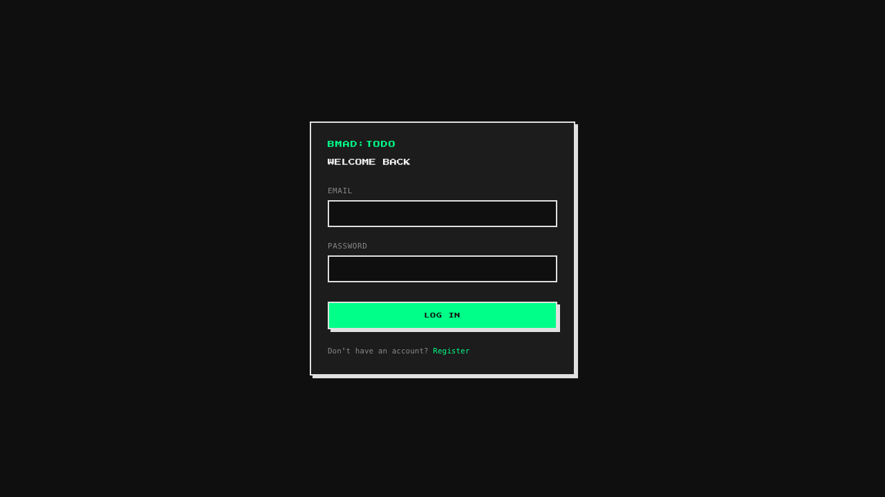
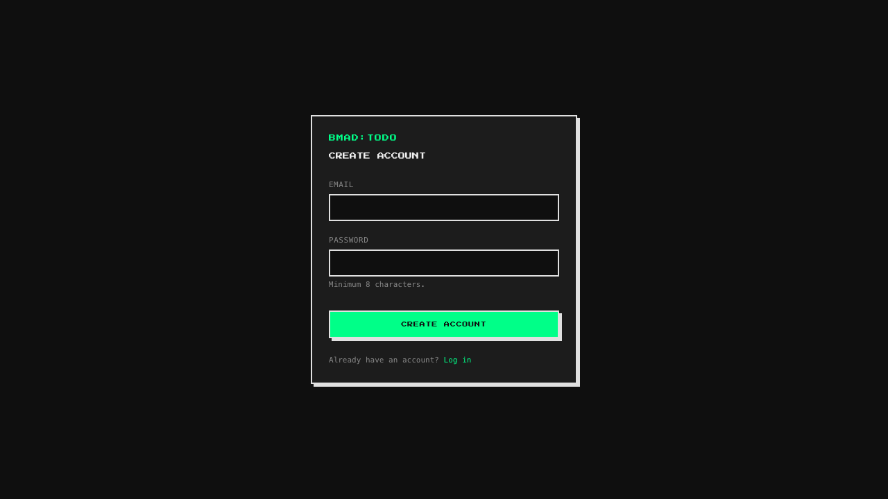
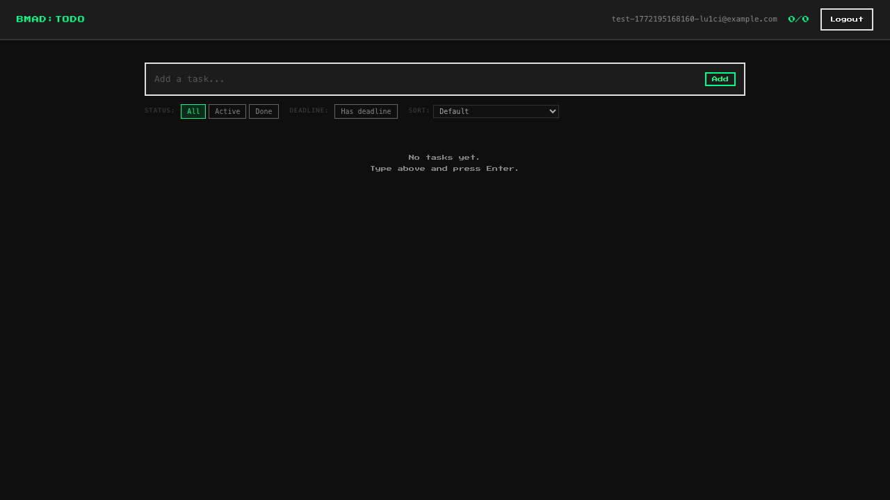
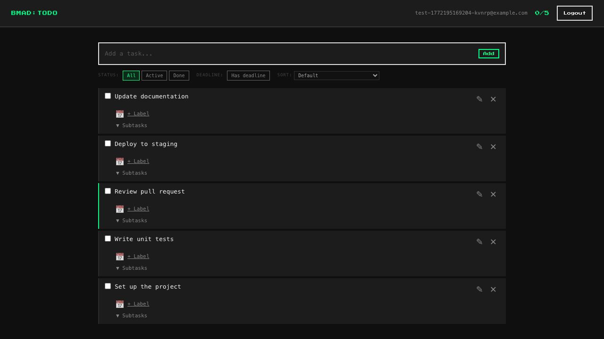
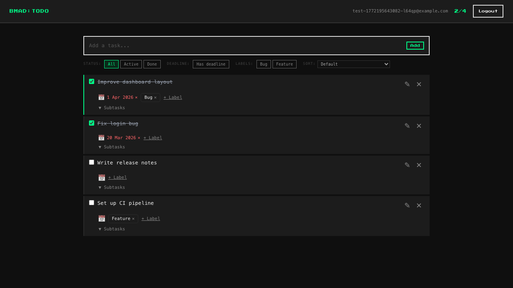

# bmad-todo-app

A full-stack task management web application built with React, Fastify, and PostgreSQL. All services run in Docker containers and are orchestrated with Docker Compose.

> [!NOTE]  
> This project was built as a hands-on test of the [BMAD Method](https://docs.bmad-method.org/) — a Spec-Driven Development (SDD) framework. The entire product lifecycle was followed end-to-end: Product Brief → PRD → UX Design → Architecture → Epics & Stories → Implementation, using BMAD agents and workflows throughout. The codebase reflects what can be produced when AI-assisted development is guided by structured, spec-first methodology.

## Features

- **Authentication** — User registration and login with long-lived sessions via JWT cookies
- **Task management** — Create, edit, complete/uncomplete, and delete tasks with a live task count
- **Labels** — Attach and remove labels on tasks
- **Deadlines** — Set and remove due dates per task
- **Subtasks** — Add, complete, and delete subtasks within a task
- **Filtering & sorting** — Filter tasks by label, completion status, and deadline; sort the task list
- **Accessibility** — WCAG 2.1 AA compliance, full keyboard navigation

## Screenshots

| Login | Register |
|-------|----------|
|  |  |

| Task list — empty | Task list — with tasks |
|-------------------|------------------------|
|  |  |

**Mixed task list** — completed tasks, active tasks with labels and deadlines:



## Requirements

- [Docker](https://docs.docker.com/get-docker/) and [Docker Compose](https://docs.docker.com/compose/)
- Node.js 20+ and npm (for local development and testing only)

## Installation

1. Clone the repository and navigate to the project root.

2. Copy the example environment file and fill in your values:

   ```bash
   cp .env.example .env
   ```

3. Build and start all services:

   ```bash
   docker-compose up --build
   ```

The application will be available at:

| Service  | URL                     |
| -------- | ----------------------- |
| Frontend | http://localhost:3000   |
| API      | http://localhost:3001   |

## Project Structure

```
bmad-todo-app/
├── backend/        # Fastify REST API (TypeScript + PostgreSQL)
├── frontend/       # React SPA (Vite + Tailwind CSS)
├── e2e/            # Playwright end-to-end tests
├── docs/           # Architecture and API documentation
├── screenshots/    # Application screenshots
└── docker-compose.yml
```

## Configuration

All configuration is supplied through the root `.env` file. See `.env.example` for the full list of variables:

| Variable            | Description                                  | Default        |
| ------------------- | -------------------------------------------- | -------------- |
| `POSTGRES_USER`     | PostgreSQL username                          | `bmad_user`    |
| `POSTGRES_PASSWORD` | PostgreSQL password                          | —              |
| `POSTGRES_DB`       | PostgreSQL database name                     | `bmad_todo`    |
| `JWT_SECRET`        | Secret used to sign JWT tokens               | —              |
| `NODE_ENV`          | Runtime environment (`development`/`production`) | `development` |
| `PORT`              | API server port (inside the container)       | `3001`         |

## Testing

Each part of the monorepo has its own test suite.

### Backend — unit and integration tests

```bash
cd backend
npm install
npm test
```

Tests use Vitest and Testcontainers (spins up a real PostgreSQL container). Requires Docker to be running.

### Frontend — unit tests

```bash
cd frontend
npm install
npm test
```

Tests use Vitest and Testing Library against a jsdom environment.

### E2E — end-to-end tests

Run the full Docker Compose stack first, then:

```bash
cd e2e
npm install
npx playwright install
npm test
```

Additional Playwright commands:

```bash
npm run test:ui       # Playwright interactive UI
npm run test:headed   # Run in a visible browser
npm run test:report   # Open the last HTML report
npm run screenshots   # Regenerate screenshots in screenshots/
```

## Tech Stack

| Layer     | Technology                                          |
| --------- | --------------------------------------------------- |
| Frontend  | React 19, Vite, TypeScript, Tailwind CSS, Radix UI, TanStack Query, React Router 7 |
| Backend   | Fastify 5, TypeScript, PostgreSQL 16, @fastify/jwt  |
| E2E tests | Playwright, axe-core                                |
| Infra     | Docker, Docker Compose, Nginx                       |


## API Documentation

See [docs/api-contracts-backend.md](docs/api-contracts-backend.md) for the full REST API reference, and [docs/](docs/) for architecture, data models, and integration guides.
