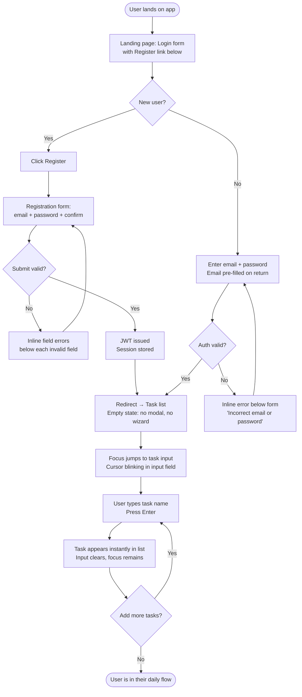
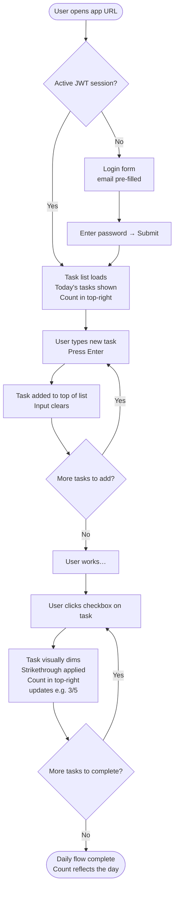
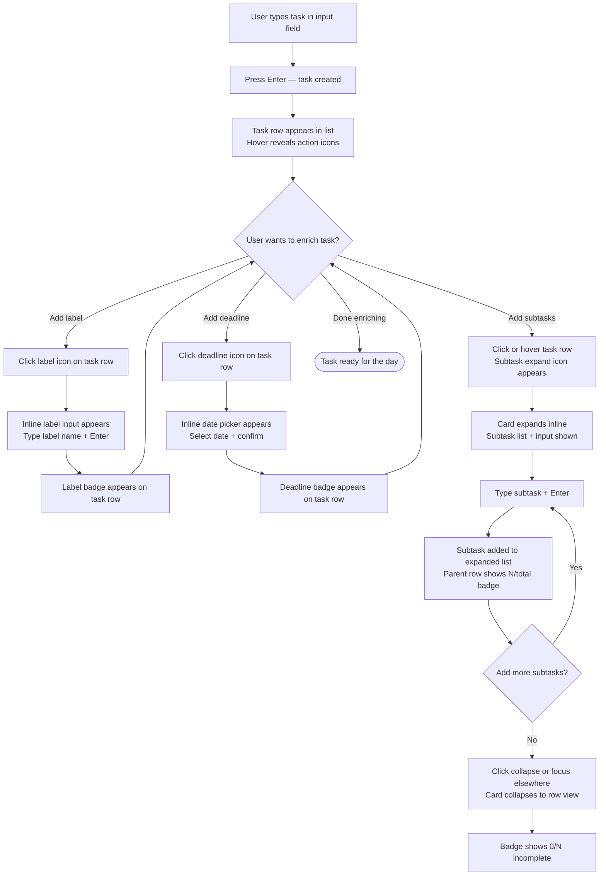
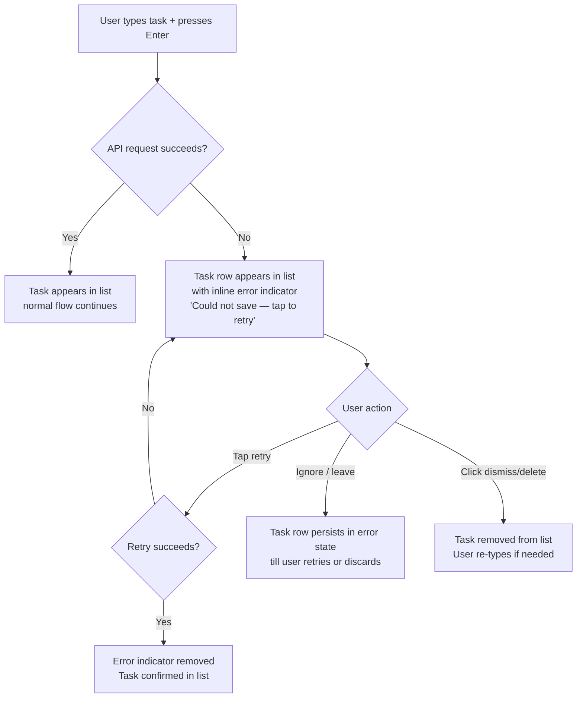
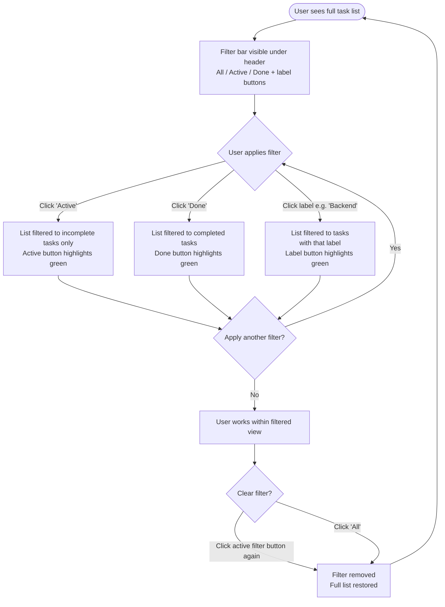

# UX Design Specification bmad-todo-app

**Author:** Alessio
**Date:** 2026-02-23

---

<!-- UX design content will be appended sequentially through collaborative workflow steps -->

## Executive Summary

### Project Vision

bmad-todo-app is a lightweight, full-stack personal task management web app with a pixel-art-inspired retro UI. The core philosophy is radical simplicity — zero configuration, zero onboarding, instant usability. The task list is always the hero of the UI; every other element (task count, filters) is supportive infrastructure that stays out of the way. It doubles as Alessio’s daily professional ritual tool and a public portfolio artifact.

### Target Users

A single, well-defined primary user — the **Developer Planner**: a software developer or technical professional who treats daily task planning as a deliberate, conscious professional ritual rather than reactive capture. They are comfortable with technical tools, use a desktop as their primary device, value sub-second performance and clean architecture they can inspect, and find genuine satisfaction in completing tasks and tracking personal progress over time. They come to bmad-todo-app frustrated by over-structured tools (Jira) and over-featured ones (Notion).

### Key Design Challenges

1. **Pixel-art aesthetic vs. accessibility** — The retro visual identity must coexist with WCAG 2.1 AA compliance. Color contrast, focus states, and interaction affordances need deliberate design rather than afterthoughts.
2. **Task enrichment without friction** — Labels, deadlines, and subtasks are opt-in and must never feel like they're in the way. The design must make enrichment easy and feel invisible when not needed.
3. **Task count as ambient progress indicator** — The completed/total task count (e.g. `3/5`) must always be visible on-page but must not draw the eye or compete for attention with the task list. It is a passive progress cue — users glance at it, they do not chase it. The display updates quietly; no animation or emphasis on change.
4. **Filter/sort discoverability** — Filtering and sorting are MVP features but secondary workflows. They must be findable without cluttering the primary planning view.

### Design Opportunities

1. **The ritual moment** — The app has a genuine opportunity to feel like a purposeful tool rather than a utility. Thoughtful micro-interactions and pixel-art personality on task completion can create a satisfying daily ritual without gamification theatrics.
2. **Empty state as onboarding** — The first time a user arrives at an empty task list is the most powerful UX moment. A well-crafted empty state (with or without the seed task) communicates the app's personality and immediately invites action.
3. **Calm information hierarchy** — Because the task count is intentionally low-emphasis, the entire visual design can lean into calm clarity. The task list is always the hero; everything else (count, filters) is supportive infrastructure tucked neatly out of the main flow.

## Core User Experience

### Defining Experience

The heart of bmad-todo-app is **task creation and completion** — the tight loop of writing down what you intend to do and crossing it off when done. Every design decision must protect and accelerate this loop. Authenticated users land directly on their task list with no intermediate screen; the app is always ready for input the moment it opens.

Task creation is a single inline text field at the top of the task list. The user types a task title and presses Enter — the task appears immediately below with no modal, no required secondary fields, no confirmation step. Labels, deadlines, and subtasks are available inline after creation, purely on demand.

### Platform Strategy

- **Platform:** Web SPA — client-side routing, no full-page reloads after initial load
- **Primary devices:** Desktop (mouse and keyboard as primary input)
- **Secondary:** Fully usable on smaller screens; no dedicated mobile-first design pass
- **Offline:** Not required — graceful inline error feedback on network failure
- **Browser support:** Modern evergreen browsers only (Chrome, Firefox, Safari, Edge)

### Effortless Interactions

The following interactions must require zero cognitive load — no decisions, no extra steps:

- **Task creation** — one field, Enter to submit. The task list is the landing page; the field is always in focus.
- **Task completion** — single click on a checkbox. Instant visual state change. Task count updates quietly in the header.
- **Return visit login** — email pre-filled on the login page, one click to authenticate, immediately on the task list.
- **Enrichment (labels, deadline, subtasks)** — accessible inline from the task card without navigating away; invisible if unused.

### Critical Success Moments

1. **First task creation** — the user types and presses Enter; the task appears instantly. No spinner, no modal, no required fields. This moment establishes trust and speed.
2. **First morning return** — the user opens the app, email is pre-filled, one click and they're on their list. This moment converts a first-time user into a daily habit.
3. **Task completion** — checking off a task produces a clear visual state change (struck through, dimmed, or visually distinct). The task count updates quietly in the header (`3/5`). Satisfying without being theatrical.

### Experience Principles

1. **The task list is always the destination** — authenticated users land here instantly, every time. No dashboards, no onboarding screens, no intermediary steps.
2. **Task creation has no prerequisites** — a title and Enter is all that is ever required. Every additional field (labels, deadline, subtasks) is opt-in and accessed after creation, never before.
3. **Enrichment is invisible until needed** — labels, deadlines, and subtasks must not visually complicate the task list for users who don't use them.
4. **Task count is ambient, not central** — always visible, never emphasized. The task list is the hero. The count (`completed/total`) is context.
5. **Speed is a feature** — every interaction (create, complete, delete) must feel instant. Latency is a UX failure, not just a performance one.

## Desired Emotional Response

### Primary Emotional Goals

- **Focused and in control** — the minimal interface removes noise; the task list feels like the user's own space, not a product's UI
- **Calm and deliberate** — not exciting, not gamified, not urgent. A quiet professional ritual that fits naturally into a developer's day
- **Efficient and capable** — every action works immediately; nothing fights back or demands more than the user intended to give
- **Quietly satisfied** — task completion produces a subdued sense of progress, not celebration. The count updating quietly in the header is noticed, not cheered

### Emotional Journey Mapping

| Moment | Target Feeling |
|---|---|
| First visit / registration | Pleasantly surprised — distinctive aesthetic, zero onboarding friction |
| First task creation | Trust — it worked instantly, exactly as expected |
| Daily return visit | Familiar and ready — email pre-filled, task list waiting, no ceremony |
| Task completion | Quiet satisfaction — clear visual state change, task count updates calmly |
| Network error / failure | Calm confidence — inline feedback, retry available, no alarm |

### Micro-Emotions

- **Confidence over confusion** — the interface never leaves the user wondering what to do next
- **Trust over skepticism** — instant saves, persistent sessions, and reliable state build trust quickly
- **Satisfaction over excitement** — completion is rewarding but not theatrical; the ritual is the reward
- **Calm over anxiety** — no urgent indicators, no pressure, no noise competing for attention

### Design Implications

- **Focused and in control** → single-column task list, clear visual hierarchy, no competing panels or widgets
- **Calm and deliberate** → restrained animation (none or minimal on count update), muted palette with pixel-art character rather than bright gamification colors
- **Quiet satisfaction** → task completion uses a clear but understated visual change (strikethrough + dimming); no confetti, no pop-ups
- **Calm confidence on errors** → inline error messages at task level, not modal interruptions; retry affordance immediately available
- **Familiar on return** → email pre-fill, immediate task list, no re-onboarding

### Emotional Design Principles

1. **Calm is the aesthetic** — visual and interaction design should feel composed, not stimulating. The pixel-art identity adds personality without adding energy.
2. **Reward through clarity, not celebration** — the satisfaction of completing a task comes from the clean state change and the visible list getting shorter, not from animations or sounds.
3. **Never alarm the user** — errors, empty states, and edge cases must feel handled and safe, never urgent or alarming.
4. **Familiarity compounds over time** — each return visit should feel incrementally more natural. The app earns emotional loyalty through consistency, not novelty.

## UX Pattern Analysis & Inspiration

### Inspiring Products Analysis

**Linear (linear.app)**
The gold standard for developer-first calm. Linear's core lesson: speed and keyboard-first interactions communicate respect for the user's time. Navigation never gets in the way. The list IS the product — nothing competes with it. Dark-mode-first with a muted, high-contrast palette that feels intentional, not decorative.

**Things 3 (Cultured Code)**
The definitive minimal task manager. Things 3 proves that a task manager can have rich structure (areas, projects, tags, deadlines) while feeling completely simple on the surface. Enrichment is always one level away, never in your face. Task creation is a single field. The empty state is inviting, not clinical.

**Raycast**
Developer-first launcher that demonstrates how a tool can feel like a superpower while remaining completely calm. Every interaction is instant. The trigger is always the same — one shortcut — and the rest flows. The app trusts the user completely.

### Transferable UX Patterns

**Navigation Patterns:**
- **Single-surface navigation** (Linear, Things 3) — authenticated users live on one primary view; filtering is reachable without leaving home. Adapt: task list as the permanent home, filters as lightweight in-view controls.
- **No onboarding wizard** (Things 3, Raycast) — the empty state IS the onboarding. A well-crafted empty state teaches by invitation, not instruction.

**Interaction Patterns:**
- **Inline creation, always visible** (Things 3) — task input is always present at the top of the list, never behind a button or modal. Tab or click to enrich without leaving the flow.
- **Keyboard-first, click-friendly** (Linear, Raycast) — primary actions work equally well with keyboard or mouse; neither is second-class.
- **Instant feedback, no spinners on fast operations** (Linear) — task creation and completion must feel synchronous even when they're not. Optimistic UI updates maintain the sense of speed.

**Visual Patterns:**
- **High-contrast completed state** (Things 3) — completed tasks are visually distinct (strikethrough + muted) but remain visible in the list; they don't disappear immediately, giving users a sense of what they accomplished.
- **Persistent but subordinate secondary info** (Linear) — metadata (labels, dates) is always visible on the item but visually lighter than the title. Pixel-art equivalent: smaller pixel font or muted color for secondary task attributes.

### Anti-Patterns to Avoid

- **Modal-first task creation** — any product that puts task creation behind a “+ New Task” button that opens a form modal adds one unnecessary step to the most critical interaction. Avoid entirely.
- **Prominent gamification chrome** — progress bars, badge pop-ups, streak counters, and celebration animations would undermine the calm, deliberate tone of bmad-todo-app.
- **Empty list anxiety** — a blank white page with no guidance is disorienting. The empty state must communicate purpose and invite the first action naturally.
- **Filter/sort as primary UI** — apps that surface filter controls prominently make the list feel like a database. Filters should be tucked but accessible — secondary to the list itself.
- **Navigation chrome that competes with content** — sidebars with icons, tabs, breadcrumbs all reduce focus on the task list. Keep structural UI minimal.

### Design Inspiration Strategy

**Adopt:**
- Inline persistent task creation field (Things 3 pattern) — directly supports “task creation has no prerequisites”
- Calm, high-contrast completed-task visual treatment (Things 3) — supports quiet satisfaction without theatrical feedback
- Speed-first optimistic UI updates (Linear) — reinforces “speed is a feature”

**Adapt:**
- Linear's keyboard-first navigation → adapted for a simpler single-surface app; full keyboard nav (Tab, Enter, Escape) without needing a command palette
- Things 3's enrichment-on-demand → adapted to pixel-art inline affordances; labels/deadlines expand inline, never in a separate modal

**Avoid:**
- Any gamification animation on count update — keep count display ambient and static
- Modal dialogs for task creation or enrichment
- Navigation chrome beyond what’s necessary (top bar + count + task list)

## Design System Foundation

### Design System Choice

**8bitcn-ui** (github.com/TheOrcDev/8bitcn-ui) — a shadcn/ui-inspired React component library with a native 8-bit/pixel-art aesthetic, built on Tailwind CSS.

### Rationale for Selection

- **Aesthetic alignment** — pixel-art visual language is built in, not retrofitted. The retro identity of bmad-todo-app is a first-class citizen of the component system, not a CSS override layer.
- **Ownership model** — components are copy-pasted and owned locally (shadcn/ui architecture), eliminating version lock-in and enabling full customization without fighting framework opinions.
- **Accessible primitives** — inherits Radix UI headless components under the hood (via shadcn/ui lineage), providing keyboard navigation, ARIA attributes, and focus management out of the box — directly supporting WCAG 2.1 AA compliance.
- **Tailwind-native** — integrates naturally with utility-first CSS; design tokens (colors, spacing, typography) are Tailwind variables, making theming straightforward.
- **React-native** — exact match for the chosen frontend framework.
- **Solo developer pragmatism** — avoids building a custom pixel design system from scratch while retaining full control over every component used.

### Implementation Approach

- Use 8bitcn-ui as the base component palette: buttons, inputs, checkboxes, cards, dialogs, dropdowns
- Extend with custom Tailwind utilities for layout (task list, sidebar, top bar)
- Keep the component footprint minimal — only import and own components actually used in the app
- Apply a consistent Tailwind color palette that respects WCAG 2.1 AA contrast ratios within the pixel-art theme

### Customization Strategy

- **Typography** — use a pixel/monospace font (e.g., Press Start 2P or similar) for headings and UI chrome; fall back to a readable system font for task body text to preserve legibility at small sizes
- **Color palette** — define a small, deliberate palette of 4–6 colors: background, surface, primary action, completed/muted state, error, and count indicator. All must pass AA contrast.
- **Component overrides** — completed task state (strikethrough + muted), inline creation field, and count display will require custom Tailwind variants layered on 8bitcn-ui base components
- **Animation** — disable or minimize any built-in transitions on count-adjacent components; keep completion feedback to a CSS class swap (no JavaScript animation libraries needed)

## 2. Core User Experience

### 2.1 Defining Experience

> "Type what you want to do today, press Enter — it's there. Check it off when done."

The defining experience of bmad-todo-app is the **task creation and completion loop**: the tight, zero-friction cycle of committing to a task by writing it down and marking it done. Every other feature — labels, deadlines, subtasks, task count — exists to support this loop without interrupting it.

### 2.2 User Mental Model

The Developer Planner arrives with the mental model of a **text editor for tasks**: type, Enter, done. They expect task creation to behave like a terminal command — immediate, unconditional, no ceremony. They bring zero tolerance for modals, required fields, or confirmation steps on the primary action. Completion is expected to be a single gesture with instant visual feedback.

### 2.3 Success Criteria

- Task creation: from empty field to task in the list in under 3 seconds, with a single Enter keypress
- Task completion: single click on checkbox, immediate visual state change, no secondary action required
- Both interactions work equally well via keyboard and mouse
- Neither interaction requires the user to leave the task list view

### 2.4 Novel vs. Established Patterns

This is an **established UX pattern** — inline list creation and checkbox completion are universal, well-understood mechanics. The unique contribution of bmad-todo-app is not the interaction paradigm but its **pixel-art execution** and the **ritual context** in which these interactions occur. Users should feel the pattern is familiar and the product is distinctive.

### 2.5 Experience Mechanics

**Task Creation Flow:**

| Step | Detail |
|---|---|
| Initiation | Inline input field visible and focused at top of task list on every page load |
| Interaction | User types title; presses Enter to submit |
| Feedback | Task appears immediately (optimistic UI update); field clears and refocuses |
| Completion | List reflects new task; user is ready to add the next without any additional gesture |

**Task Completion Flow:**

| Step | Detail |
|---|---|
| Initiation | User clicks checkbox on task card |
| Interaction | Single click — no hold, drag, or double-click required |
| Feedback | Task shifts to completed visual state (strikethrough + muted opacity); task count in header updates passively (`3/5`) |
| Completion | Task remains visible in completed state in the list; no automatic removal or navigation |

## Visual Design Foundation

### Color System

**Direction:** Dark/charcoal base — terminal and code editor aesthetic. High contrast, developer-native. Pixel-art chrome pops against the dark background.

**Palette (semantic tokens):**

| Token | Role | Suggested Value |
|---|---|---|
| `color-bg` | Page background | Deep charcoal `#1a1a2e` or near-black `#0f0f0f` |
| `color-surface` | Task card / panel surface | Slightly lighter `#1e1e2e` or `#1c1c1c` |
| `color-border` | Pixel borders (8bitcn-ui) | Off-white `#e0e0e0` for contrast against dark bg |
| `color-primary` | Primary action (buttons, checkbox active) | Retro accent — green `#00ff88` or amber `#ffcc00` |
| `color-text` | Primary text | Near-white `#f0f0f0` |
| `color-text-muted` | Secondary text (labels, metadata) | Medium gray `#888` |
| `color-completed` | Completed task text | Muted/dimmed `#555` |
| `color-error` | Inline error state | Retro red `#ff4444` |

All color pairs must pass WCAG 2.1 AA contrast ratio (≥4.5:1 for normal text, ≥3:1 for large text). Final values confirmed during implementation against actual 8bitcn-ui rendering.

### Typography System

**UI Chrome / Headings:** `Press Start 2P` (Google Fonts) — pixel font for app name, section labels, count display, and empty state headers. Used sparingly at large sizes only (≥14px rendered).

**Task body text / metadata:** `ui-monospace` system stack (`JetBrains Mono`, `Fira Code`, `Consolas` fallback) — readable at compact sizes, developer-appropriate, zero additional font load.

**Type scale:**

| Level | Font | Size | Use |
|---|---|---|---|
| App title | Press Start 2P | 16px | Top bar brand mark |
| Count display | Press Start 2P | 13px | Top-right count value (e.g. `3/5`) |
| Section label | Press Start 2P | 10px | Section headers |
| Task title | ui-monospace | 14px | Task body text (active) |
| Task title (done) | ui-monospace | 14px | Strikethrough + muted |
| Metadata | ui-monospace | 12px | Labels, deadline |
| Error / hint | ui-monospace | 12px | Inline feedback |

### Spacing & Layout Foundation

**Density:** Compact — prioritize task list throughput over breathing room. The list is a productivity tool, not a showcase.

**Base spacing unit:** 4px grid. All spacing is multiples of 4px.

**Task card spacing:**
- Vertical padding per task: `8px` top/bottom
- Horizontal padding: `12px`
- Gap between task cards: `4px`
- Checkbox to text gap: `8px`

**Page layout:**
- Max content width: `860px` centered
- Main task area: flexible, fills full width
- Top bar height: `48px`
- Task creation input: pinned top of list area, always visible

**Grid:** No CSS grid for the task list — single-column flex column. Sidebar uses fixed positioning.

### Accessibility Considerations

- All interactive elements (checkbox, task title edit, buttons, dropdowns) must have visible focus rings — styled with pixel-art border pattern (8bitcn-ui provides these)
- Minimum touch/click target: `32px × 32px` even in compact layout
- Task count display color must not rely on color alone to convey meaning — always accompanied by the numeric fraction (e.g. `3/5`)
- Destructive action (delete task) requires explicit confirmation (two-step: reveal delete button on hover/focus, confirm on click)
- Reduced motion: respect `prefers-reduced-motion` — no transitions for users who opt out

---

## Design Direction Decision

### Design Directions Explored

Six directions were mocked up across two color palettes (green, amber, cyan, purple, red) and four layout patterns (left sidebar, right sidebar, top bar, filter bar). All previewed in `_bmad-output/planning-artifacts/ux-design-directions.html`.

| Direction | Accent | Layout | Count Placement |
|---|---|---|---|
| D1 | Green `#00ff88` | Left sidebar | Sidebar block |
| D2 | Amber `#ffcc00` | Single column | Top bar pill |
| D3 | Cyan `#00e5ff` | Right sidebar | Right sidebar |
| D4 | Purple `#9945ff` | Single column + filter bar | Header inline |
| D5 | Red `#ff4466` | Ultra-minimal | Top bar inline |
| D6 | Green `#00ff88` | Pixel card | Top bar chip |

### Chosen Direction: Hybrid

**Palette:** D1 — green accent `#00ff88`, dark charcoal background `#0f0f0f` / `#1a1a1a`
**Layout:** No sidebar — single column, max `860px` centered
**Count display:** Top-right corner of top bar, stacked under `user | logout` — shows completed/total tasks (e.g. `3/5`), ambient and unobtrusive
**Filter bar:** Horizontal filter row under the top bar (D4-style) — always visible, subdued
**Subtask UX:** Inline card expansion — collapsed shows `2/3 ↓` badge; click/expand reveals subtask list + inline input field; no modal

### Design Rationale

The hybrid removes the sidebar entirely, keeping the layout as focused as possible on the task list itself. Task count visibility is preserved top-right (complies with FR21 on count display) but is deliberately small and subordinate to the task content. The D4 filter bar is retained because it surfaces filtering without requiring navigation or interaction cost. The green palette from D1 is the most aligned with the pixel-terminal aesthetic and the 8bitcn-ui library's default dark theme.

The decision to remove the sidebar aligns with the core design principle: **task list is the hero.** Secondary information (count display, filters) earns presence only when it does not take pixel real estate away from tasks.

### Implementation Notes (8bitcn-ui)

- **Filter pills:** `<Button variant="outline">` — active state adds green border `border-color: #00ff88`
- **Task input:** bare `<Input>` with green `2px` border, full width
- **Task rows:** custom `div` with `border-left` accent for hover/active state (not a card component — avoids excess padding)
- **Count display:** plain styled `span` elements in the top-right header zone — no special component needed
- **Subtask area:** conditional render below parent task row when `expanded` flag is true; reuses same input component at smaller scale
- **Checkbox:** 8bitcn-ui `<Checkbox>` component styled with green accent color

---

## User Journey Flows

### Flow 1: First Use — Registration → First Task

The highest-stakes journey. Every second of friction here costs a user.



**Design decisions baked in:**
- No welcome modal, no tutorial overlay — task list is immediate
- Auto-focus on task input after landing on list view
- Email pre-fill on return (read from `localStorage`, populated before render)

---

### Flow 2: Core Daily Loop — Return Visit Through Task Completion

The flow Marco runs every single morning. Must be frictionless.



**Design decisions:**
- Task count updates inline in top-right — no animation flourish, just the fraction updates (e.g. `2/5` → `3/5`)
- Completed tasks stay in the list (dimmed), not hidden — user sees full day's work
- Input always at top, always focused-ready — no scroll required to add

---

### Flow 3: Rich Task Creation — Labels, Deadline, Subtasks



**Design decisions:**
- Label and deadline are added inline on the task row — no modal, no separate form
- Subtask expansion triggered by clicking the subtask badge/icon on the task row
- Badge on collapsed parent: `0/3` = all pending, `3/3` = all done
- Completing all subtasks does **not** auto-complete parent — user must explicitly check parent (per PRD)

---

### Flow 4: Error Recovery — Network Failure



**Design decisions:**
- Error appears inline on the task row itself, not a toast that disappears
- Retry is a single tap/click — no confirmation step
- Fast re-creation is the fallback UX (per PRD): input is always visible, re-typing is 5 seconds

---

### Flow 5: Filtered Task View



**Design decisions:**
- Filter bar is always visible — zero cost to filter (no dropdown to open)
- Active filter highlighted with green border, same as primary accent
- Filters are additive (label + Active), cleared individually or via "All"
- No filter state persists across sessions — each visit starts with "All"

---

### Journey Patterns

| Pattern | Applies To | Implementation |
|---|---|---|
| **Inline feedback, never modal** | Task creation, label add, subtask add, errors | All interactions happen in-row, in-place |
| **Input always ready** | Daily loop, error recovery | Task input at top of list, auto-focused after each action |
| **Optimistic UI** | Task creation, checkbox | Task appears immediately; syncs in background; error state on failure |
| **Zero navigation for core flow** | First use through completion | User never leaves the task list view for primary actions |
| **Progressive disclosure** | Subtasks, labels, deadline | Basic task row → hover reveals enrichment icons → click expands |

### Flow Optimization Principles

1. **Minimum clicks to value:** Registration → first task in under 5 interactions. Return visit → new task in 2 (click URL, type + Enter).
2. **Keyboard-native primary path:** Task creation, completion toggle (Space on focused row), and filter switching all keyboard accessible.
3. **Failure is cheap:** Error recovery = one tap. Accidental delete recovery = re-type in 5 seconds. App does not punish mistakes.
4. **Count is ambient context:** User never needs to navigate to see the task count — it’s always in the header. No separate history page or navigation required.
5. **Filters are free:** Filter bar always rendered, zero interaction cost to activate.

---

## Component Strategy

### Design System Components (8bitcn-ui)

8bitcn-ui provides the foundational primitives. These are used as-is or with minor token overrides:

| Component | Usage in bmad-todo-app |
|---|---|
| `<Button variant="outline">` | Filter pills (All / Active / Done / label), secondary actions |
| `<Button variant="ghost">` | Inline action icons on task hover (edit, delete) |
| `<Button variant="destructive">` | Delete confirmation action |
| `<Input>` | Task creation input (top of list), subtask inline input, label inline input |
| `<Checkbox>` | Task completion toggle — styled with `#00ff88` accent |
| `<Badge>` | Base for label badges, deadline badges, subtask count badges |
| `<Tooltip>` | Icon button labels |
| `<Separator>` | Section dividers in header zone |

All 8bitcn-ui components use the copy-paste ownership model — tokens are overridden via Tailwind CSS variables at the project level; no upstream dependency to maintain.

---

### Custom Components

#### `<AppHeader>`

**Purpose:** Top bar housing brand, navigation anchor, and user info + task count.
**Anatomy:** `[BMAD:TODO brand left] [user + logout | task count stacked top-right]`
**States:** Authenticated only (unauthenticated users see the login page, not the header)
**Accessibility:** `<header>` landmark, brand is an `<h1>` or `<span role="heading">`, logout is a `<button>`, task count is `aria-label="Tasks completed: N of M"`
**Key constraint:** Count display must never shift layout when digit count changes — use fixed-width monospace span

---

#### `<TaskRow>`

**Purpose:** The primary UI unit of the app. Displays one task with all metadata and interactive affordances.
**Anatomy:**
```
[ Checkbox ][ Task title text ][ Label badge ][ Deadline badge ][ Subtask badge ][ pts ][ hover: icons ]
```
**States:**
- `default` — full opacity, left border dim (`#2a2a2a`)
- `hover` — left border green (`#00ff88`), action icons fade in (edit, delete)
- `active/focused` — left border green, focus ring on checkbox
- `done` — 0.5 opacity, strikethrough on title, left border `#222`
- `error` — amber/red inline indicator strip, retry affordance visible
- `expanded` — `<SubtaskPanel>` renders below, row border fully green

**Keyboard:** `Space` toggles checkbox when row is focused; `Enter` opens inline label/deadline input; `Delete` key reveals delete confirmation
**Accessibility:** `role="listitem"`, checkbox has `aria-label="Mark [task title] as done"`, action icons have `aria-label` tooltips

---

#### `<SubtaskPanel>`

**Purpose:** Inline expansion area below a `<TaskRow>` showing subtasks + add field.
**Anatomy:**
```
  [ ▸ indent ][ subtask checkbox ][ subtask title ]
  [ ▸ indent ][ subtask checkbox ][ subtask title (done, strikethrough) ]
  [ ▸ indent ][ + ][ inline input: "Add subtask…" ]
```
**States:**
- `collapsed` — not rendered; parent `<TaskRow>` shows `N/total ↓` badge
- `expanded` — renders below parent row with `margin-left: 28px` indent, `border-left: #00aa55`
- Individual subtask states: `pending`, `done` (strikethrough + dim)

**Trigger:** Click on the subtask badge (`2/3 ↓`) on the parent `<TaskRow>`
**Accessibility:** `aria-expanded` on trigger button, subtask list is `role="list"`, subtask inputs have `aria-label="Add subtask to [task title]"`

---

#### `<FilterBar>`

**Purpose:** Always-visible horizontal row of filter/sort controls directly under `<AppHeader>`.
**Anatomy:**
```
[ All ][ Active ][ Done ] … [ label pills ] … [ sort ▾ ]
```
**States:**
- Each pill: `inactive` (dim border) / `active` (green border + text)
- Label pills: dynamically rendered from distinct labels present in today's task list
- Sort button: dropdown using `<DropdownMenu>` from 8bitcn-ui

**Behavior:** Multiple filters additive (label + Active simultaneously). “All” clears all filters. No filter state persists across sessions.
**Accessibility:** `<nav aria-label="Task filters">`, each button has `aria-pressed` toggled on active state, sort dropdown has `aria-haspopup="listbox"`

---

#### `<TaskCountDisplay>`

**Purpose:** Renders the user's name, logout link, and today's task count stacked in the top-right of `<AppHeader>`.
**Anatomy:**
```
alessio | logout
3/5 tasks
```
**States:** Count value (`completed/total`) updates on task completion or task creation — just the fraction, no transition/animation
**Constraint:** `aria-live="polite"` so screen readers announce the new value when it changes
**Width:** Fixed min-width so layout does not reflow as digits change (e.g., `9/9` → `10/10`)

---

#### `<EmptyState>`

**Purpose:** Displayed when task list is empty (first use, or all filters return no results).
**First-use variant:**
```
[pixel art cursor blink]
No tasks yet. Type above and press Enter.
```
**No-results variant (filtered):**
```
No tasks match this filter.
[Clear filters] button
```
**Accessibility:** `aria-live="polite"` region so it announces when filters produce no results

---

#### `<InlineTaskError>`

**Purpose:** Error state indicator rendered inside the `<TaskRow>` when a save/sync operation fails.
**Anatomy:**
```
[ ! ][ Could not save — tap to retry ][ × dismiss ]
```
**States:** `visible` (amber left-border on task row) / `retrying` (spinner in place of `!`) / `resolved` (error strip removes itself)
**Accessibility:** `role="alert"` so it's announced immediately on appearance; retry button has `aria-label="Retry saving [task title]"`

---

### Component Implementation Strategy

- **Token override first:** Apply `#00ff88` accent and `#0f0f0f` / `#1a1a1a` backgrounds via Tailwind CSS variables before touching component internals. Many 8bitcn-ui components will adopt the correct visual automatically.
- **Compose from primitives:** `<TaskRow>` uses 8bitcn-ui `<Checkbox>` and `<Badge>` internally — don't reinvent what's provided.
- **No external state in display components:** `<TaskRow>`, `<SubtaskPanel>`, `<FilterBar>` are presentational. State lives in React context or the parent page component.
- **One component = one file:** Each custom component in `src/components/` with a co-located `*.test.tsx` file.

### Implementation Roadmap

**Phase 1 — Core (required for any usable session):**
1. `<AppHeader>` + `<TaskCountDisplay>` — always visible shell
2. `<TaskRow>` — base state (no subtasks, no enrichment yet)
3. `<Input>` task creation (task list input — 8bitcn-ui, configured)
4. `<EmptyState>` — first-use experience

**Phase 2 — Enrichment (required for full PRD compliance):**
5. `<SubtaskPanel>` — inline subtask expansion
6. `<FilterBar>` — label/status filtering
7. Label badge + deadline badge extensions of `<Badge>`

**Phase 3 — Resilience:**
8. `<InlineTaskError>` — network failure feedback + retry

---

## UX Consistency Patterns

### Button Hierarchy

Three levels of action priority, each with a distinct visual weight:

| Level | Variant | Usage | Example |
|---|---|---|---|
| **Primary** | `<Button>` default — green border + fill | Confirms a destructive or irreversible action | Delete confirm |
| **Secondary** | `<Button variant="outline">` | Filter pills, cancel, secondary actions | `All`, `Active`, `Done` |
| **Ghost** | `<Button variant="ghost">` | Icon-only inline actions revealed on hover | Edit, Delete (on task row hover) |
| **Destructive** | `<Button variant="destructive">` | Final delete confirmation only | "Yes, delete" |

**Rules:**
- Never two primary buttons side-by-side
- Destructive buttons require a two-step interaction (hover reveals → explicit click confirms)
- Ghost buttons always have a `Tooltip` with `aria-label` — icon alone is never the only affordance

---

### Feedback Patterns

| Situation | Pattern | Visual |
|---|---|---|
| Task saved successfully | **Implicit** — task appears in list | No toast, no alert — success is self-evident |
| Task completion | **Implicit** — row dims + strikethrough + count updates | No celebratory animation |
| Save failed (network) | **Inline error on row** — `<InlineTaskError>` | Amber left-border, retry affordance |
| Form validation error | **Inline below field** — red text under the offending input | Never global toast for local errors |
| Loading state | **Skeleton rows** — same height as task rows, animated shimmer off by default (`prefers-reduced-motion`) | Full list replaced with 3–5 skeleton rows |
| Global error (auth failure, 500) | **Full-page error state** — centered message + "Try again" button | Only used when the entire app cannot function |

**Rules:**
- Never use auto-dismissing toasts for errors — user must acknowledge or retry
- Toasts (if ever used) only for non-critical confirmations, duration ≥ 4 seconds, dismissible
- Never rely on color alone — error states include text label + icon

---

### Form Patterns

All forms in bmad-todo-app are **inline** — no dialog, no page navigation.

| Form | Entry Trigger | Submission | Cancel |
|---|---|---|---|
| Task creation | Always visible at top of list | `Enter` key | `Escape` clears input, focus remains |
| Label add | Click label icon on task row | `Enter` key | `Escape` or click elsewhere collapses |
| Deadline add | Click deadline icon on task row | Date picker select | `Escape` or click elsewhere collapses |
| Subtask add | Click `N/total ↓` badge | `Enter` key | `Escape` or click elsewhere collapses panel |
| Registration / Login | Dedicated auth page | `Enter` on last field or Submit button | N/A (no in-app cancel) |

**Validation rules:**
- Task title: required, max 255 characters — validate on submit, not on keystroke
- Label: optional, max 30 characters, free-form text; no autocomplete in MVP
- Deadline: optional, date only (no time), must be today or future; validated by date picker constraint
- Empty submit: no-op — input field shakes subtly (if `prefers-reduced-motion: no-preference`) or simply does nothing

---

### Navigation Patterns

bmad-todo-app has a **single primary view**: the task list. Navigation is minimal by design.

| Destination | How to get there | How to return |
|---|---|---|
| Task list (primary) | Direct URL / app root | Always home |
| Auth pages | Automatic redirect if no valid JWT | Automatic redirect after successful auth |

**Rules:**
- No sidebar navigation in MVP
- Filter bar does not constitute navigation — it is part of the task list view
- No breadcrumbs needed (single-level depth)

---

### Empty States

| Scenario | Message | Action |
|---|---|---|
| First use (no tasks ever) | "No tasks yet. Type above and press Enter." | None — focus is already on input |
| All tasks completed | "All done for today. `N/N` complete!" | None — shows the count, lets it land |
| Filter returns nothing | "No tasks match this filter." | `[Clear filters]` button |

**Rules:**
- Empty states are text-only in MVP (no heavy illustrations — keeps pixel aesthetic lean)
- “All done” state is the only place a light celebration is permitted (the count itself is the reward)

---

### Loading States

| Scenario | Pattern |
|---|---|
| Task list loading on page open | 4 skeleton rows (same height as task rows), pulsing opacity if `prefers-reduced-motion: no-preference` |
| Task creation (optimistic UI) | Task appears immediately — no loader. Error state appears if save fails. |
| Checkbox toggle (optimistic UI) | State changes immediately — no loader. Error state if sync fails. |
| Auth submit | Submit button shows spinning pixel icon — input disabled during request |

**Rules:**
- Prefer **optimistic UI** for all task mutations — show the result immediately, handle errors after
- Never block the UI waiting for a server response for task creation or completion

---

### Interaction Micro-patterns

| Pattern | Rule |
|---|---|
| **Hover reveals** | Action icons (edit, delete) appear on `<TaskRow>` hover — opacity 0 → 1. Duration: 100ms if `prefers-reduced-motion: no-preference`, instant otherwise. |
| **Focus follows action** | After submitting task creation input: input clears, focus stays on input. After subtask add: focus stays on subtask input. |
| **Escape = cancel** | `Escape` closes / collapses any inline editor without saving. Universal across all inline forms. |
| **Keyboard shortcuts** | `Space` toggles checkbox on focused task row. No other global shortcuts in MVP. |
| **Click outside = cancel** | Clicking outside an expanded subtask panel or inline editor collapses it without saving. |
| **Pixel cursor on interactive elements** | `cursor: pointer` on all clickable elements — consistent with 8bitcn-ui defaults. |

---

## Responsive Design & Accessibility

### Responsive Strategy

bmad-todo-app is **desktop-primary, mobile-capable**. The core daily use case (morning task planning, batch task completion) happens on a desktop or laptop. Mobile is a secondary context: glancing at the list, marking tasks done, quick task add while away from the desk.

**Desktop (primary):** Max `860px` centered column within a full-width dark background. Extra whitespace on either side of the column at large viewports. No layout change needed between 1024px and 4K — the content column doesn’t grow beyond `860px`.

**Tablet (secondary):** Same single-column layout, column width fills available space with `16px` horizontal padding. Filter pills may wrap to two lines on narrow tablets — acceptable.

**Mobile (tertiary):** Full-width column with `12px` horizontal padding. Filter bar scrolls horizontally (`overflow-x: auto`, no visible scrollbar) so pills don’t wrap. Count display in header collapses to count only (username hidden on screens < 400px). Task row action icons (edit/delete) revealed by a dedicated `⋯` menu icon instead of hover.

---

### Breakpoint Strategy

Mobile-first CSS, with upward breakpoints:

| Breakpoint | Width | Layout change |
|---|---|---|
| `sm` | `≥ 480px` | Input field gets slightly more padding |
| `md` | `≥ 768px` | Header shows username alongside count |
| `lg` | `≥ 1024px` | Content column capped at `860px`, centered with side gutter |

No layout changes above `lg` — the app is deliberately narrow by design.

**Tailwind config:**
```js
screens: {
  sm: '480px',
  md: '768px',
  lg: '1024px',
}
```

---

### Accessibility Strategy

**Target: WCAG 2.1 Level AA** — as specified in the PRD.

**Color contrast:**
- `#0f0f0f` bg + `#f0f0f0` text → ≈18:1 ✅ (AAA)
- `#1a1a1a` bg + `#888` muted text → ≈4.6:1 ✅ (AA)
- `#1a1a1a` bg + `#00ff88` green accent → ≈8.5:1 ✅ (AAA)
- **Risk:** completed task text `#555` on `#141414` → ≈3.5:1 ⚠️ — mitigated by strikethrough + opacity as additional semantic signals; raise to `#666` if needed

**Touch targets:**
- Checkbox: minimum `32×32px` tap target (CSS padding around the `16px` visual element)
- Filter pills: minimum `32px` height
- Action icons on mobile: `⋯` menu button, minimum `44×44px`

**Semantic HTML:**
- `<header>` for `<AppHeader>`
- `<main id="main-content">` for the task list area
- `<nav aria-label="Task filters">` for `<FilterBar>`
- `<ul>` / `<li>` for task list and subtask lists
- `<h1>` for brand name (single heading on page — intentional; app, not document)

**Keyboard tab sequence:**
1. Skip-to-content link (visually hidden, appears on focus)
2. Task creation input
3. Task rows (each `<li tabindex="0">`)
4. Checkbox within focused task row (`Space` toggles)
5. Filter pills
6. Count display / logout

**ARIA requirements:**
- `aria-live="polite"` on count display — announces update after task creation or completion
- `aria-live="polite"` on task list region — announces new task after creation
- `role="alert"` on `<InlineTaskError>` — announced immediately
- `aria-label` on all icon-only buttons (edit, delete, expand, collapse)
- `aria-expanded` on subtask panel trigger
- `aria-pressed` on filter pills

**`prefers-reduced-motion`:**
```css
@media (prefers-reduced-motion: reduce) {
  * { transition: none !important; animation: none !important; }
}
```
All hover transitions and skeleton shimmer disabled for users who opt out.

---

### Testing Strategy

**Responsive:**
- Chrome DevTools device simulation (iPhone SE, iPad, 1440px desktop) as development baseline
- Real device test on at least one physical phone before marking responsive complete
- Target browsers: Chrome, Firefox, Safari (latest stable)

**Accessibility:**
- **Automated:** axe DevTools browser extension — zero critical violations required before each merge
- **Keyboard:** Full keyboard-only navigation walkthrough on each new interactive feature
- **Screen reader:** VoiceOver on macOS — test task creation and completion flow at minimum
- **Contrast:** Verified via WebAIM Contrast Checker for all foreground/background pairs
- **Reduced motion:** Tested with `prefers-reduced-motion: reduce` active in OS settings

---

### Implementation Guidelines

**Responsive:**
- Use Tailwind responsive prefixes (`md:`, `lg:`) — no custom CSS media queries unless unavoidable
- `overflow-x: auto` on `<FilterBar>` container for horizontal scroll on mobile
- Avoid `vh` units for layout heights — prefer `dvh` or flex-based sizing (mobile browser chrome issue)

**Accessibility:**
- Every new interactive element must ship with its `aria-label` or `aria-labelledby` — no exceptions
- Skip-to-content link at top of `<AppHeader>`: `<a href="#main-content" className="sr-only focus:not-sr-only">Skip to content</a>`
- Never suppress focus rings with `outline: none` without a custom equivalent
- All inputs have an associated `<Label>` or `aria-label` — `placeholder` is supplemental only
- Delete action two-step pattern satisfies WCAG 2.1 SC 3.3.4 (Error Prevention)
